<h1 align="center">Hi 👋, I'm Kalani Atapattu</h1>

<h3 align="center">
  Software Engineering Undergraduate | Full-Stack Developer | Backend & Data Enthusiast
</h3>

  
  

---

## 👨‍💻 About Me

* 🎓 Software Engineering Undergraduate
* 💻 Full-Stack Developer interested in building reliable and maintainable software systems
* ⚙️ Experienced with **Java, Spring Boot, React, Python and R**
* 🗄️ Experienced in working with **PostgreSQL and relational databases**
* 🔧 Interested in **Backend Development, Software Architecture and Data Engineering**
* 📊 Experienced in **Data Analysis, Statistical Computing and Data Visualization**
* 🧪 Experienced in building **automated testing and validation pipelines**
* 🚀 Experienced with **GitHub Actions and CI/CD workflows**
* 🐧 Comfortable working with **Linux and development environments**

---

## 💻 Tech Stack

### Languages

  
  
  
  
  

### Backend & APIs

  
  
  
  
  

### Frontend

  
  
  
  
  
  

### Databases

  

### Data & Statistics

  
  
  
  

### Tools & Platforms

  
  
  
  
  
  

---

## 📊 GitHub Statistics

  
  

  

---

## 🤝 Let's Connect

I'm always interested in collaborating on:

* Full-Stack Applications
* Backend Development
* Data Analysis & Statistics
* Software Engineering
* Open-Source Projects
